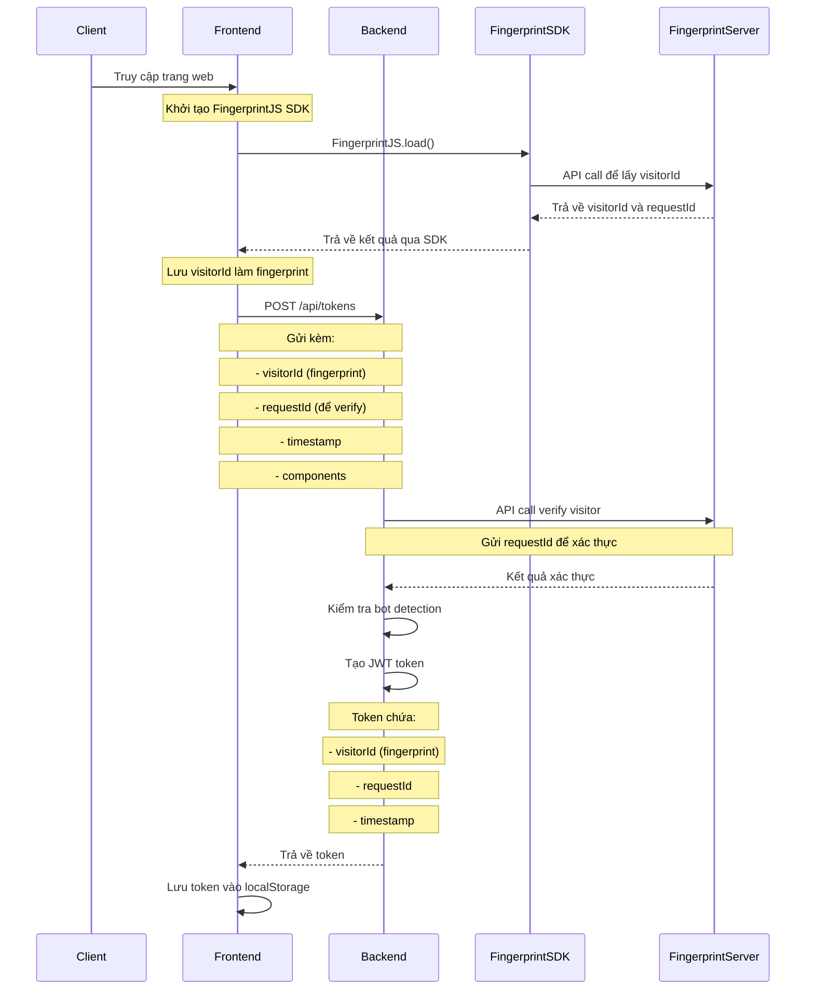
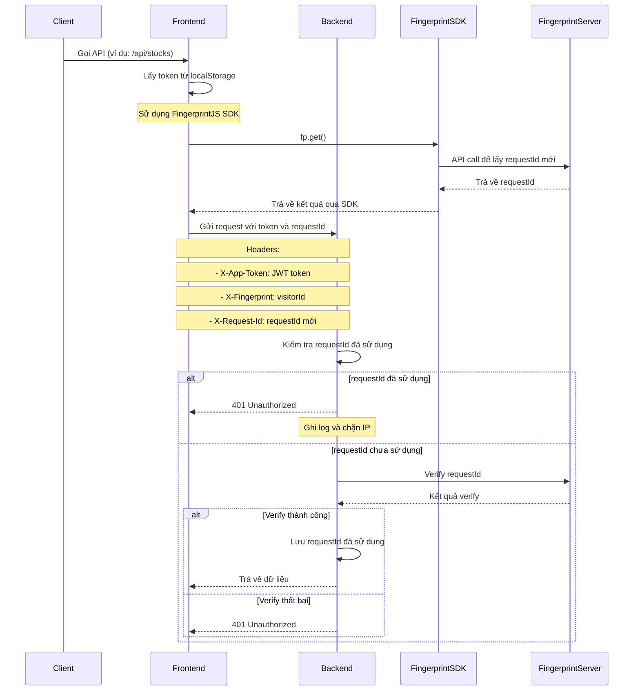
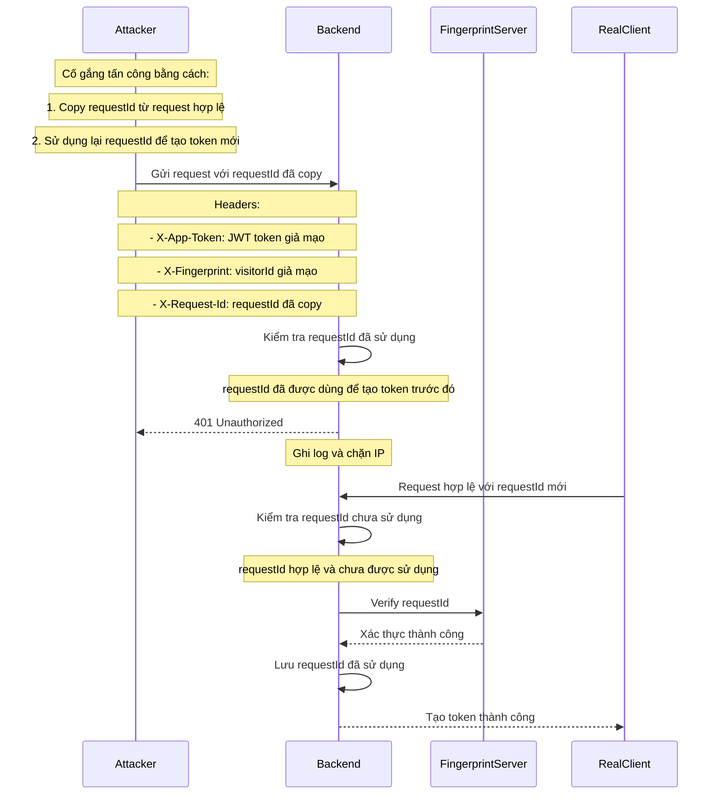
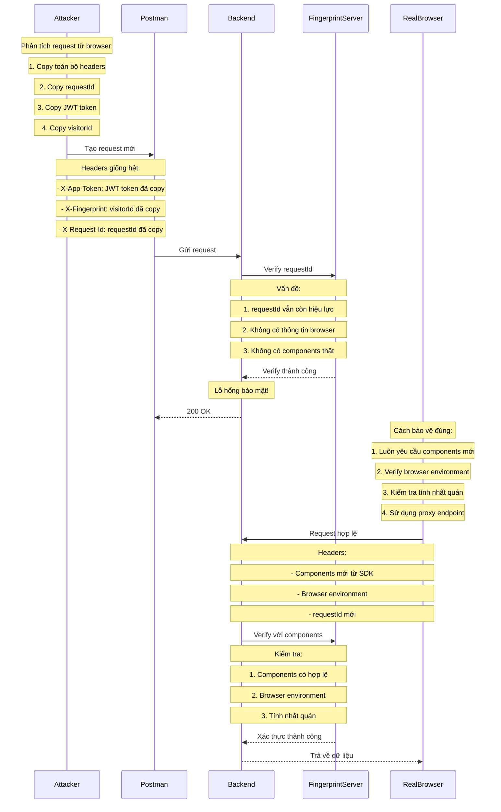

# Fingerprint Authentication Demo

Ứng dụng demo xác thực thiết bị sử dụng FingerprintJS Pro.

## Flow Xác Thực

### 1. Flow Tạo Token



### 2. Flow Bảo Vệ API



### 3. Flow Chống Bot và Tái Sử Dụng RequestId



### 4. Flow Phân Tích Lỗ Hổng và Cách Bảo Vệ



## Cấu hình FingerprintJS

### Frontend (SDK)
```typescript
// Khởi tạo SDK
const fpPromise = FingerprintJS.load({
  apiKey: 'your-api-key',
  endpoint: 'https://api.fpjs.io', // hoặc proxy endpoint
  region: 'ap'
});

// Sử dụng SDK
const fp = await fpPromise;
const result = await fp.get();
// result.visitorId: định danh thiết bị
// result.requestId: mã xác thực request
```

### Backend (API)
```java
// Cấu hình trong application.properties
fingerprint.api.key=your-api-key
fingerprint.api.url=https://api.fpjs.io
fingerprint.api.region=ap

// Sử dụng API để verify
@PostMapping("/verify")
public ResponseEntity<?> verifyVisitor(
    @RequestParam String requestId,
    @RequestParam String visitorId
) {
    // Gọi API của Fingerprint Server để verify
    // Trả về kết quả xác thực
}
```

## Tính năng

- Xác thực thiết bị thông qua FingerprintJS Pro
- Hiển thị thông tin chi tiết về thiết bị truy cập:
  - Mã định danh thiết bị
  - Thông tin cơ bản (IP, trình duyệt, hệ điều hành)
  - Lịch sử truy cập
  - Độ tin cậy của xác thực
  - Thông tin yêu cầu
- Giao diện người dùng thân thiện với Ant Design
- Hỗ trợ đa ngôn ngữ (Tiếng Việt)
- Responsive design

## Cấu trúc dự án

```
fingerprint-auth-demo/
├── fingerprint-auth-demo-frontend/     # Frontend React + Vite
│   ├── src/
│   │   ├── components/                 # React components
│   │   │   ├── VisitorInfo.tsx        # Component hiển thị thông tin thiết bị
│   │   │   ├── ErrorPage.tsx          # Component xử lý lỗi
│   │   │   └── StockTable.tsx         # Component hiển thị dữ liệu chứng khoán
│   │   ├── services/                  # API services
│   │   │   └── api.ts                 # Service xử lý API calls
│   │   └── App.tsx                    # Component chính
│   └── .env                           # Cấu hình môi trường
└── fingerprint-auth-demo-backend/      # Backend Spring Boot
    └── src/
        └── main/
            ├── java/                  # Java source code
            └── resources/             # Cấu hình backend
```

## Cài đặt và Chạy

### Frontend

1. Cài đặt dependencies:
```bash
cd fingerprint-auth-demo-frontend
npm install
```

2. Cấu hình môi trường:
- Tạo file `.env` từ `.env.example`
- Cập nhật các biến môi trường:
  - `VITE_FINGERPRINT_API_KEY`: API key của FingerprintJS Pro
  - `VITE_FINGERPRINT_API_URL`: URL API của FingerprintJS Pro
  - `VITE_USE_PROXY`: Sử dụng proxy hay không (true/false)
  - `VITE_API_BASE_URL`: URL của backend API

3. Chạy development server:
```bash
npm run dev
```

### Backend

1. Cài đặt Java 17 hoặc cao hơn
2. Cấu hình trong `application.properties`:
```properties
# JWT Configuration
jwt.secret=your-secret-key-here
jwt.expiration=300

# Security Configuration
app.security.max-failed-attempts=5
app.security.failed-attempt-window=3600

# Rate Limiting
app.rate.limit.window=3600
app.rate.limit.max=100

# Token Configuration
app.token.expiration=300
app.token.timestamp.tolerance=120
```

3. Chạy ứng dụng:
```bash
./mvnw spring-boot:run
```

## API Endpoints

### Frontend
- `/`: Trang chủ hiển thị thông tin thiết bị
- `/admin`: Trang quản trị (yêu cầu xác thực)

### Backend
- `/api/fpjs`: Proxy endpoint cho FingerprintJS Pro
- `/api/stocks`: API lấy dữ liệu chứng khoán
- `/api/tokens`: API quản lý token

## Công nghệ sử dụng

- Frontend:
  - React 18
  - Vite
  - Ant Design
  - FingerprintJS Pro
  - TypeScript
  - Styled Components

- Backend:
  - Spring Boot
  - Java 17
  - Maven
  - jjwt 0.12.5

## Bảo mật

- Xác thực và bảo mật:
  - Sử dụng FingerprintJS Pro để xác thực thiết bị
  - JWT token với HS256 và key size 256-bit
  - Kiểm tra fingerprint trong token validation
  - Rate limiting để tránh quá tải
  - Theo dõi và chặn các nỗ lực xác thực thất bại
  - Ghi log chi tiết cho các sự kiện bảo mật
  - **Mỗi requestId chỉ được sử dụng một lần để tạo token**
  - **Lưu trữ và kiểm tra các requestId đã sử dụng**
  - **Tự động chặn các request sử dụng requestId đã dùng**

## Giấy phép

MIT License